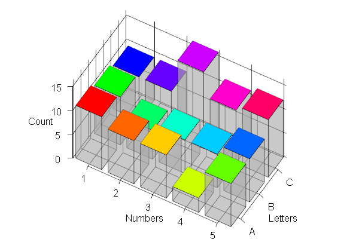
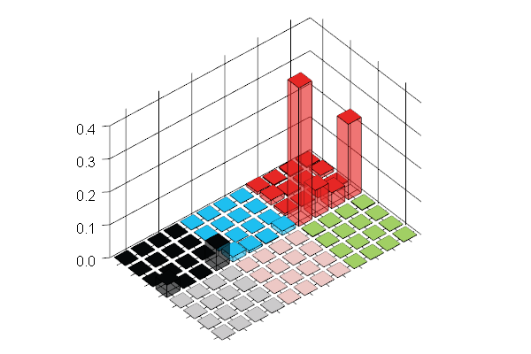
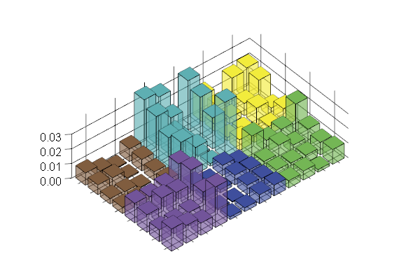

# 3dbarplot

R package for creating 3D barplots. Read the documentation or included vignette for full details.

Easily make beautiful 3D barplots like this:

  

Includes an easy-to-use wrapper function for making "legoplots" of mutation/trinucleotide context data like this:

  
  

